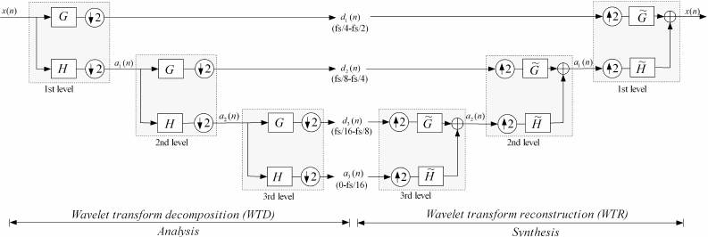
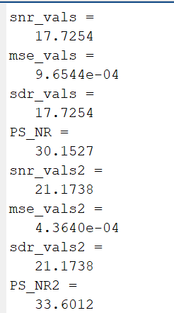
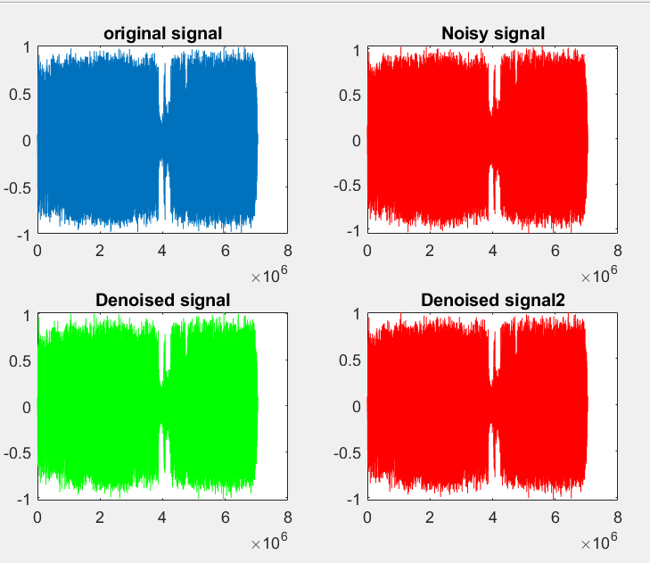
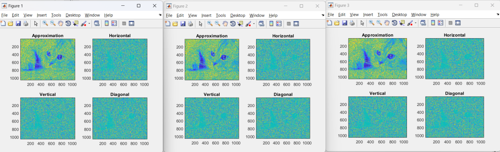
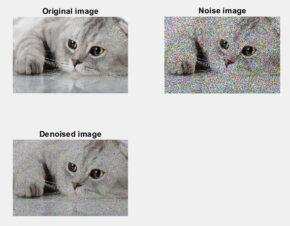

# Denoising Wavelet Tranform
**This is a project from DSP course from __March 2023__ to __June 2023__**
The project is built from ***MatLab***, including two main parts:
- Audio denoising
- Image denoising
This project's purpose is to remove noise in image and audio with the application of 

# Software requirement
**Matlab or Octave software is require**
# Results
- ** Audio Denoise **
After 3rd denoising the raw audio contain SNR as below:

The denoised audio graph is shown:

- ** Image Denoise **
The RGB image is separated into R, G, B plans:

The result after and before denoising is shown as below:

